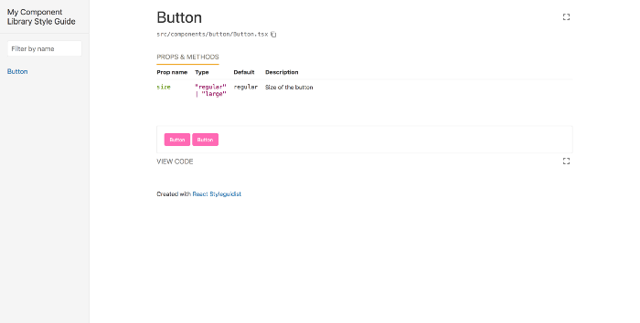

I was working on a personal project, where I developed a few components which I thought are worth sharing, but how? I can publish them on NPM, but the user should be able to tinker with them no just see the default examples, that’s when I found out [React Styleguidist](https://react-styleguidist.js.org/), I struggled around for 1 day to get this for the first time and now it takes around 10 minutes with styled-components setup.

We will use React Styleguidist, as not only one can interact with the components, one can also change the props and write a custom function to see how the component behaves.

React Styleguidist does not provide boilerplate like [Create React App](https://facebook.github.io/create-react-app/docs/getting-started) but its a plugin and can be integrated easily with CRA or to any React App with webpack, I have divided steps into 3 parts.

1.  Create React App with [TypeScript](https://www.typescriptlang.org/)
2.  Add React Styleguidist
3.  Add TypeScript Support

## Create React App

Create a React setup using CRA using `npx` for the latest version or `yarn create`

```bash
// Using yarn
yarn create react-app my-component-library --typescript
// Using npm
npx create-react-app my-app --typescriptcd my-component-library
// Make sure App is running
yarn start
```

## Add React Styleguidist

Let’s React Styleguidist to our project using

```bash
yarn add -D react-styleguidist
```

As we are going to use this project as a component library will never use the default `start` and `build` script. So we will replace them with **styleguidist** scripts, it should look like this

```json
"start": "npx styleguidist server",
"build": "npx styleguidist build",
"test": "react-scripts test",
"eject": "react-scripts eject"
```

Let’s start our server using `yarn start` , the following page will show up.


This is because we haven’t told the styleguidist where our components are, we even don’t have any component yet.

Let's add a simple button component in `src/components/button` folder.

```jsx
// src/components/button/Button.tsx

import  as React from "react";


class Button extends React.PureComponent {
  render() {
    return (
      <button
        style={{
          border: "none",
          padding: "8px 12px",
          background: "hotpink",
          borderRadius: "4px",
          color: "white"
        }}
      >
        {this.props.children}
      </button>
    );
  }
}

export default Button;
```

As we have created our component inside `src/components` it will be automatically detected but we surely can add our component anywhere we want and tell the styleguidist where they are, by adding `styleguide.config.js` to root folder of the app and write following code inside it

```js
module.exports = {
  components: "path/to/your/components/**/*.tsx",
};
```

Start the server again using `yarn start` , note that we have made a change to styleguidist configuration for that to reflect we have to restart the server.

It should look something like this


To our component show up there we have to create a `README.md` inside the button folder, like this, every component will have it’s own `README.md` file where you can show a various example with different props.

```jsx
<Button>Button</Button>
```

Talking of different props lets add a prop to our `Button`

```jsx
// src/components/button/Button.tsx

import  as React from "react";

interface IProps {
  /
    Size of the button
   /
  size: "regular" | "large";
}

class Button extends React.PureComponent<IProps> {
  render() {
    const { size, children, ...rest } = this.props;
    return (
      <button
        {...rest}
        style={{
          border: "none",
          padding: size === "regular" ? "8px 12px" : "12px 16px",
          background: "hotpink",
          borderRadius: "4px",
          color: "white"
        }}
      >
        {children}
      </button>
    );
  }

  static defaultProps = {
    size: "regular"
  };
}

export default Button;
```

````jsx
// src/components/Button/README.md```js
<Button>Button</Button>
<Button size="large">Button</Button>```
````

The Above code and README.md will result into


Props & Method section has been automatically added to our component description but the type is unknown, which should not be the case as we are using TypeScript and it should show `”regular” | “large”` , React Styleguidist doesn’t support TypeScript by default it read props from PropType here it is using defaultProps to show the above, we need to add a parser which will parse props defined in typescript.

## TypeScript Support

Add react-docgen-typescript using

`yarn add -D react-docgen-typescript`

Add parser to` styleguide``.config.js `

```jsx
module.exports = {
  propsParser: propsParser: require("react-docgen-typescript").parse
};
```

You can also add descriptions to IProps using JSDoc just above the prop, it will be shown in the description section



High five 🙌 We have a component library, now we can add an individual package.json file to every component and publish them on npm.

I have pushed the above setup on [GitHub](https://github.com/paper-x/crafts/tree/1471778403300a4d4ad35db8073e2914c0fa1452), you can check out for reference or use it directly.

Thank you for Reading!
