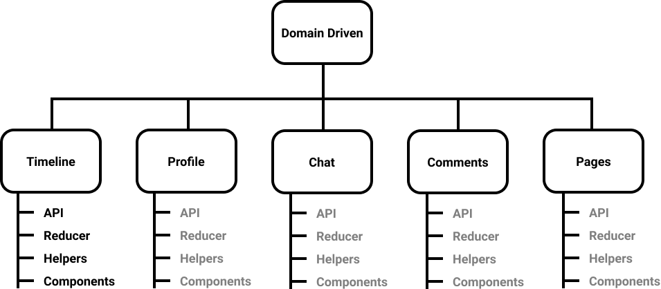

The architecture always felt like a heavy word, involving a lot of services and Databases, but it exists everywhere the way we arrange components and service in an app is the app’s architecture.

We all have been there when setting up a repo apart from choosing a bundler like webpack or fusebox what should be the directory structure? where services should go, should I keep components and API calls together or in a separate folder? This might sound silly but has a long-lasting effect on development and the way we define things because this is the architecture of that app that might belong to a far bigger ecosystem or it might be the ecosystem.

For small apps, anything will work but problems start when the app grows, especially when you are working in an ecosystem. I work as a senior UI developer at [InnovAccer](https://innovaccer.com/) and here we have a bunch of UI apps coupled together in a shell and work flawlessly as a single page app, we call it **Engine,** you can read more about it [here](https://dev.to/aregee/breaking-down-the-last-monolith-micro-frontends-hd4).

Now one of them was growing at a fast pace and two teams were working on it, from releasing the new version and maintaining the codebase, we were dependent on each other and we decided it’s not working anymore and we decoupled the app into two relatively smaller apps.

We followed a flat structure ( never liked it though 🤷🏿‍♂️) and while decoupling I was going through every part of the app, I realized how much easier it would have been if we would have followed domain-driven design principles or domain-driven structure not only to decouple but also maintaining it and using some component inside other that would have been easier. What are DDD and flat structures? Let’s start with the flat structure.

## Flat Structure

Now it doesn’t mean each file should be at the root level, that would be the worse structure to follow even for small apps. It means having a folder for each kind of functionality.

Like here they have divided the functionality or behaviour they pose but not by how & where they are used.

Now this structure is not bad at all and you must have seen this at many tutorials and it sort of makes sense for small projects until it stays small but when the app grows it should be migrated to Domain-Driven Structure, do it even before it becomes this big and you know it is going to be, but why?

## Domain-Driven Structure

What is domain-driven design architecture, we have to read the whole book to fully understand it or maybe this [quick book](https://www.infoq.com/minibooks/domain-driven-design-quickly/), loosely in layman’s term it’s the plan of your architecture around the domain or problem, it emphasises placing the primary focus of a project on the core area of the business (the core domain). Let say we are developing a social media site similar to Facebook.

> A domain-Driven Structure is a collection of flat structures, similar to a large app which is nothing but a collection of a number of small apps.

Some folder may have helpers/reducers some may not it depends on the use case, helpers might also exist at the global level if there any common helpers like `formateDate` , you might also need a store (reducer) at the global level which will be stitching together all reducers.

[Django Project](https://www.djangoproject.com/) follows the same structure by default, there we have separate apps which have views, models etc.

### Why it’s better

**Driven by the domain:** Each subfolder contains what that particular sub-domain demands

**Truly Modular:** You can plug & play where ever want to, move it to another project or break this project into a small one, though obviously, you will have to set up a mechanism where they share data and pass on events, like routing and hot patching the reducers ([https://shanebdavis.medium.com/modular-redux-a-design-pattern-for-mastering-scalable-shared-state-82d4abc0d7b3](https://shanebdavis.medium.com/modular-redux-a-design-pattern-for-mastering-scalable-shared-state-82d4abc0d7b3)).

**Independent:** Different service/packages can be used in different submodule though they might increase bundle size or one can have a different config for the same services.

**Easier Imports:** With or without the Webpack alias ( + TypeScripts base) we need to import from sibling folder instead of root. You can add each submodule as a module option in webpack too.

**Chunking:** All the dependent code is inside the single folder and can be shipped as a chunk.

There will be cases when you need to show one component inside another, let say you need to show comments component inside post, you must export a component from comment to do so then rest should be handled by the comment component because you plugged this component there, data flow can be maintained using callbacks (props) or events.

## Perfect Architecture?

No, I won’t say it’s perfect, it might have downfalls, one is too many folders, that’s why flat structure is better for a small project, but once it’s started growing switch to DDD before it’s too late.

So what's the catch, people are a little reluctant towards it because having an API folder in each module seems more troublesome than having one API folder at the root level, there are two reasons behind this feeling, one is familiarity as all tutorials have flat structure so it seems more familiar and easy to navigate, another is they haven’t realized the power of it.

## Conclusion

At the end of the day, the structure should be easy to navigate and comfortable for your team, for a small project one can choose a flat structure, for a bigger project there is no harm in trying or migrating to DDD and choose which is the best for you.

Please let me know in the comments which one you and your team follow and what pros and cons you see in both patterns.
